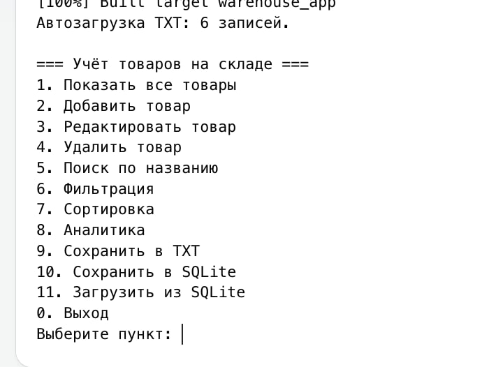
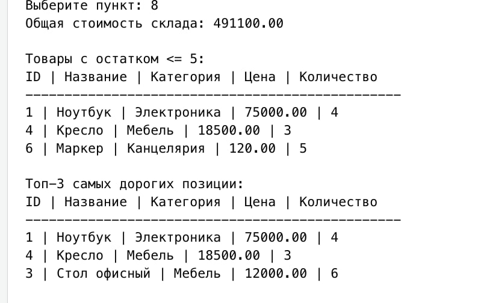
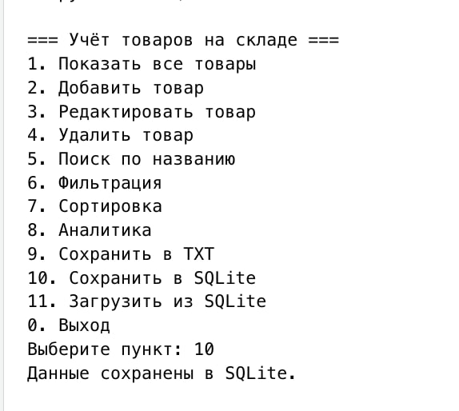

# WarehouseApp

## Данные студента

- ФИО: Басаргин Александр Евгеньевич
- Группа: 9КС-392
- Стиль кода: Google C++ Style в упрощённом виде

## Цель работы

Закрепить навыки объектно-ориентированного программирования, работы со стандартной библиотекой STL, файлового ввода-вывода, проектирования модульных приложений и обработки пользовательского ввода в C++.

## Задача

Разработать консольное приложение для автоматизации учёта товаров на складе. Программа поддерживает добавление, редактирование, удаление, поиск, фильтрацию, сортировку, аналитику, сохранение и загрузку данных в TXT, а также дополнительное сохранение и загрузку через SQLite.

## Технические требования

- Язык: C++17
- Сборка: CMake
- Хранение данных в памяти: `std::vector`
- Основной формат файла: TXT с разделителем `,`
- Формат строки: `id,name,category,price,quantity`
- Дополнительное SQL-хранилище: SQLite
- Обработка ошибок ввода: без аварийного завершения программы
- Поддержка кириллицы в Windows: `SetConsoleCP(65001)` и `SetConsoleOutputCP(65001)`

## Возможности программы

- Добавление товара с уникальным ID
- Редактирование существующей записи
- Удаление товара по ID или названию
- Валидация цены, количества, строковых полей и уникальности ID
- Поиск по названию с частичным совпадением
- Фильтрация по категории и диапазону цен
- Сортировка по цене, количеству и названию
- Расчёт общей стоимости товаров на складе
- Вывод товаров с остатком до 5 штук
- Вывод топ-3 самых дорогих товаров
- Автоматическая загрузка `data/products.txt` при старте
- Ручное сохранение в TXT
- Сохранение и загрузка из SQLite `data/products.db`

## Структура проекта

```text
WarehouseApp/
├── CMakeLists.txt
├── README.md
├── data/
│   └── products.txt
├── screenshots/
│   ├── analytics.jpg
│   ├── menu.jpg
│   └── sqlite.jpg
└── src/
    ├── FileIO.cpp
    ├── FileIO.h
    ├── Menu.cpp
    ├── Menu.h
    ├── Product.cpp
    ├── Product.h
    ├── SqliteStorage.cpp
    ├── SqliteStorage.h
    ├── Warehouse.cpp
    ├── Warehouse.h
    └── main.cpp
```

## Установка и запуск

### macOS / Linux

```bash
cmake -S . -B build
cmake --build build
./build/warehouse_app
```

### Windows

```bash
cmake -S . -B build
cmake --build build
build\Debug\warehouse_app.exe
```

Для SQLite должен быть доступен пакет `sqlite3`. На macOS и многих Linux-системах он уже установлен. Если CMake не находит SQLite, установите пакет разработки SQLite для своей системы.

## Пример данных

Файл `data/products.txt` содержит стартовые записи:

```text
1,Ноутбук,Электроника,75000,4
2,Клавиатура,Электроника,2500,18
3,Стол офисный,Мебель,12000,6
```

## Скриншоты

### Главное меню и список товаров



### Аналитика склада



### Сохранение и загрузка SQLite



## Комментарии по проекту

Самыми важными частями проекта были проверка пользовательского ввода, сохранение данных в текстовом формате и разделение программы на модули. SQLite добавлен как дополнительное хранилище для получения бонусных баллов, при этом TXT остаётся основным обязательным форматом.
